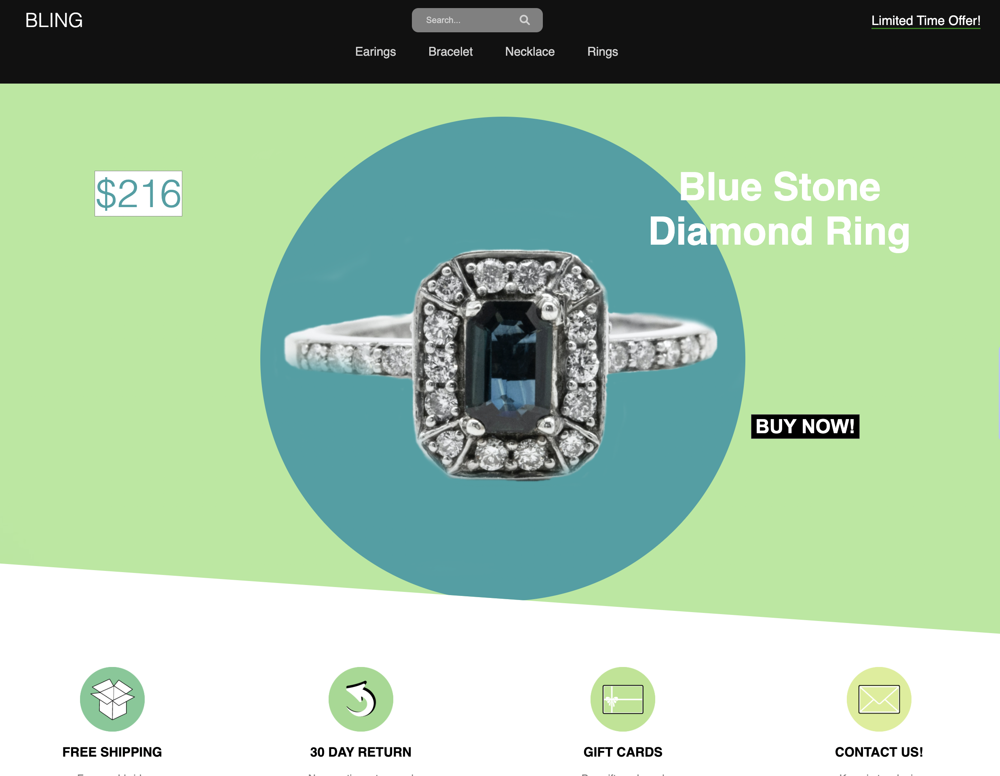
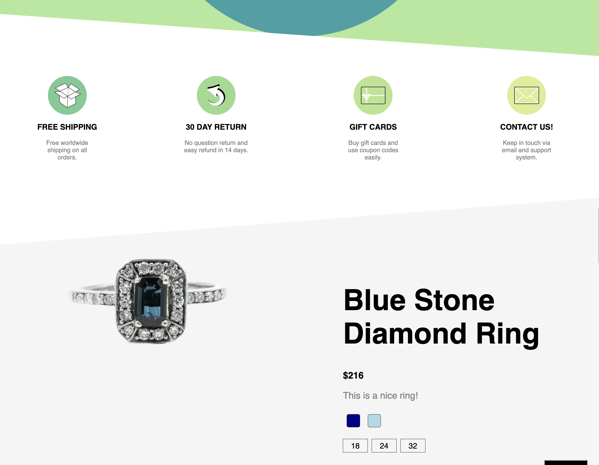
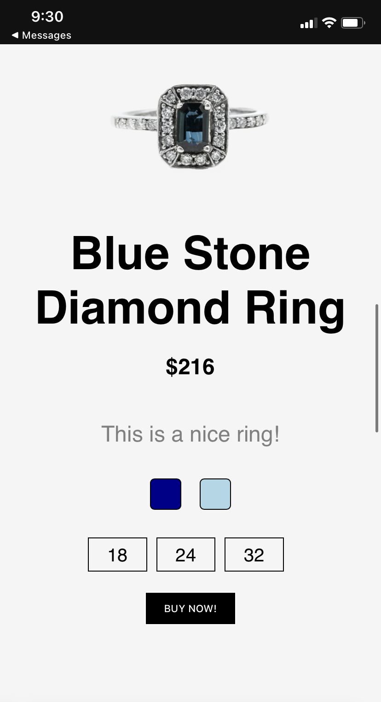

  

<h1 align="center">Bling</h1>

## Description

This is a completely mobile responsice E-commerce website for Bling Jewelry.

## Built With

- JavaScript
- HTML
- CSS

## Website

Visit 💎 [Bling](https://nicolebarranca.github.io/Bling/).

 

 

 

## Contribution

Made with ❤️ by Nicole Barranca

## Questions

Feel free to contact me directly at nikkibarranca@gmail.com if you have any questions about the repo.

You can find more of my work at [Nicole Barranca](https://github.com/NicoleBarranca).
